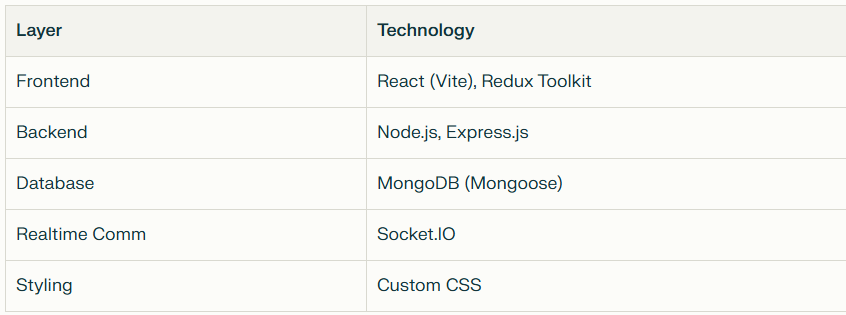
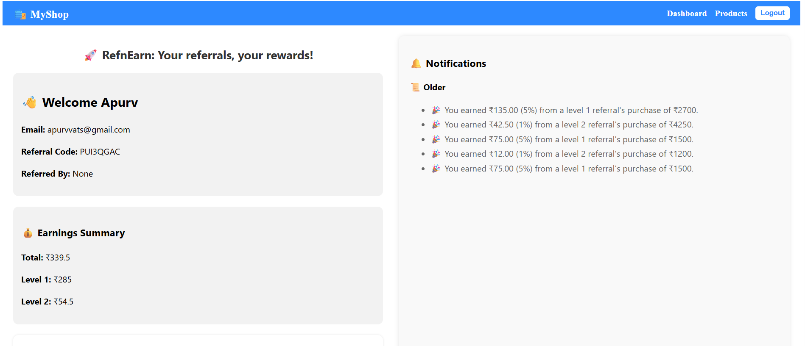
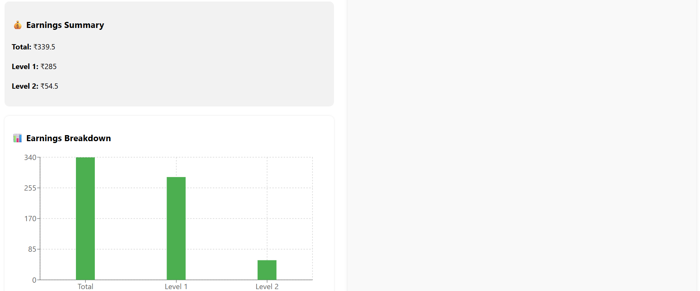
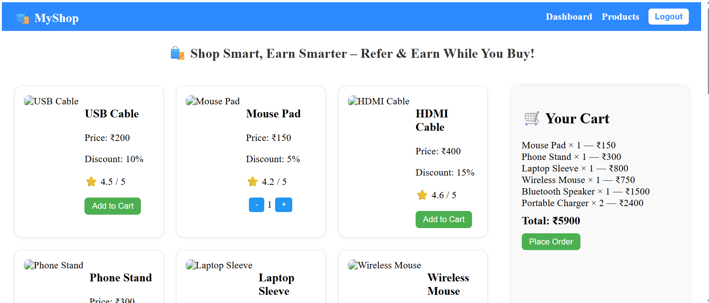
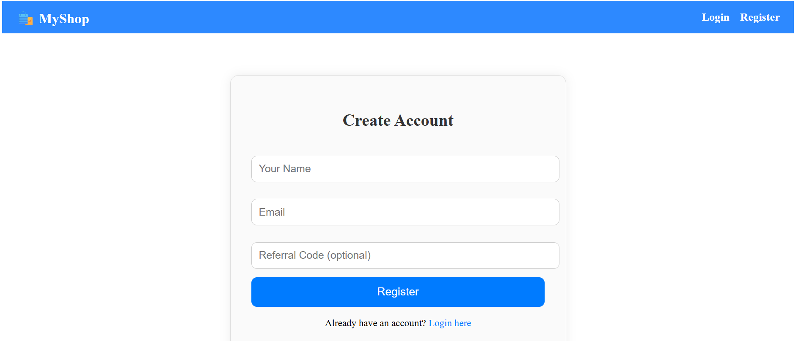
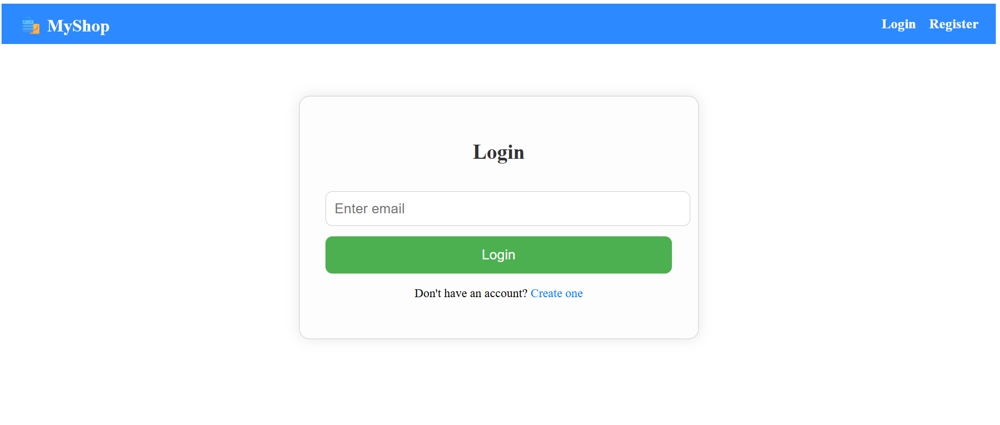
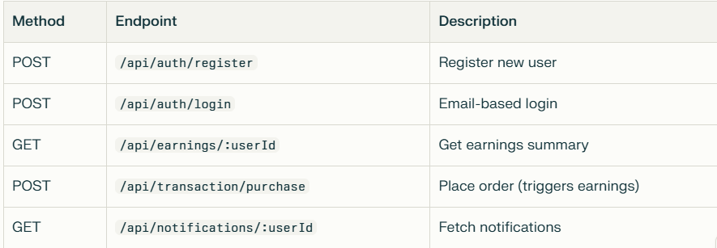

🛍️ RefnEarn — Multi-Level Referral & Profit Sharing E-Commerce System
RefnEarn is a full-stack MERN application enabling users to shop, refer others, and earn through a two-level referral commission system. The app features real-time notifications via Socket.IO, responsive UI, and intuitive UX.

✅ Features
👤 User Management
Register using referral codes (limited to 8 direct referrals/user)

Automatic referral code generation on sign-up

Email-based login (passwordless for simplicity)

🛒 Shopping & Transactions
Product listings with cart management

Order placement directly from cart

Orders above ₹1000 trigger profit sharing

💸 Referral Profit Distribution
Level 1 (Direct Referrer): 5% of transaction amount

Level 2 (Referrer's Referrer): 1% of transaction amount

Earnings stored in backend database

🔔 Real-Time Notifications
Instant earnings notifications via Socket.IO

Categorized notifications:

Recent (live updates)

Older (fetched on dashboard load)

🧱 Tech Stack

🔄 Referral Logic

User A → refers → User B
User B → refers → User C

If C places ₹2000 order:
→ B earns ₹100 (5%)
→ A earns ₹20 (1%)

🔧 Implementation Details
Backend Architecture
Referral System: Multi-level hierarchy with capped direct referrals

Profit Distribution: Automated calculation on qualifying transactions

Database Models: User, Transaction, Referral, and Notification schemas

Real-time Updates: Socket.IO triggers instant notifications

Frontend Integration
Redux Toolkit for state management

Responsive UI with cart functionality

Earnings dashboard with notification center

📦 Getting Started

Backend Setup
cd backend
npm install

Create .env file:
PORT=5000
MONGO_URI=your_mongodb_connection_string

Start server:
node index.js

Frontend Setup

cd frontend
npm install
npm run dev

🔗 API Endpoints

🧠 Key Learnings
Socket.IO integration for real-time notifications

Multi-level referral logic implementation

State management with Redux Toolkit

Building scalable Express APIs

Transaction-triggered profit distribution systems

👨‍💻 Author
Apurv Vats
📫 Email: [apurvvts@gmail.com](mailto:apurvvts@gmail.com)  
🔗 GitHub: [@ApurvVats](https://github.com/ApurvVats)

